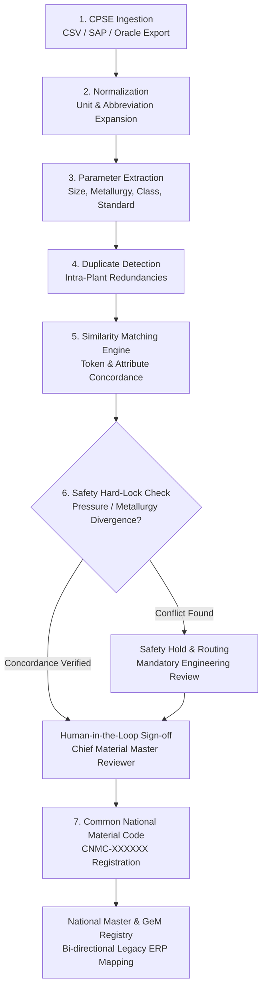

# SamagriSetu (सामग्री सेतु)
### One Nation. One Common Material Code.

[](https://www.sih.gov.in/)
[-blue.svg?style=flat-square)](https://mopng.gov.in/)
[-navy.svg?style=flat-square)](https://www.cpcl.co.in/)
[]()
[]()

---

## Executive Summary

**SamagriSetu** is an AI-assisted material master harmonization and catalog governance platform developed for the **Smart India Hackathon** under problem statement **SIH26099** (*Ministry of Petroleum & Natural Gas / Chennai Petroleum Corporation Limited*).

India's Central Public Sector Enterprises (**CPSEs**) such as **ONGC, IOCL, BHEL, and SAIL** operate critical national infrastructure and procure billions of rupees worth of identical industrial spares annually (valves, pipes, flanges, electrical drives, and instrumentation). However, because each enterprise runs isolated SAP ECC, SAP S/4HANA, or Oracle ERP installations, identical physical items are cataloged under divergent CPSE material codes, non-standard abbreviations, mixed units of measure (metric vs. imperial), and unstructured text strings.

This fragmentation creates:
- **Redundant procurement tenders** across neighboring public sector plants.
- **Inflated buffer inventories** due to zero cross-enterprise stock visibility.
- **Lost volume bargaining power** under centralized frameworks like GeM (Government e-Marketplace).
- **Engineering safety risks** when naive text matching conflates critical pressure or metallurgical ratings.

**SamagriSetu resolves this systemic challenge** by decomposing unstructured descriptions into discrete engineering parameters, comparing cross-enterprise records using multi-parameter similarity heuristics, and recommending a standardized **Common National Material Code (CNMC)**.

Operating on a **non-destructive federation model**, original CPSE ERP codes are permanently preserved for bi-directional traceability, and deterministic **Safety Hard-Locks** flag engineering discrepancies for human validation before any canonical code is authorized.

---

## SIH Problem Statement Details

| Attribute | Specification |
|---|---|
| **Problem Statement ID** | **SIH26099** |
| **Title** | AI-Driven Standardization and Harmonization of Material Codes Across CPSEs |
| **Nodal Ministry** | Ministry of Petroleum & Natural Gas (MoPNG) |
| **Nodal Enterprise** | Chennai Petroleum Corporation Limited (CPCL) |
| **Theme / Category** | Smart Automation / Software |
| **Governing Standard** | GFR 2017 & Public Procurement Guidelines |

---

## Key Capabilities & Highlights

- **Multi-CPSE Catalog Ingestion**: Ingests enterprise exports from SAP and Oracle formats representing upstream exploration (ONGC), downstream refining (IOCL/CPCL), heavy electricals (BHEL), and steel production (SAIL).
- **Domain-Calibrated Attribute Extraction**: Decomposes free-text short descriptions into canonical technical parameters: component type, nominal bore (metric/imperial), pressure rating, metallurgy, end connection, and governing standard (ASME/API/ASTM/IS).
- **Deterministic Safety Hard-Locks**: Automatically blocks automated merging when critical parameters conflict (e.g., Class 150 vs. Class 300, or SS304 vs. SS316 corrosion limits), routing items to engineering review.
- **Common National Material Code (CNMC)**: Generates structured, unique canonical identifiers (`CNMC-XXXXXX`) representing uniform equipment identities across India.
- **Bi-Directional Legacy Traceability**: Preserves 100% of original CPSE enterprise codes (`ONGC-0001`, `IOCL-0001`, etc.) mapped to the assigned national code without disrupting local ERP operations.
- **Human-in-the-Loop Governance Console**: Chief Material Master Reviewers inspect side-by-side attribute matrices, verify evidence, and approve, reject, or modify standardized records with cryptographic audit logging.
- **Interactive 3D Convergence Topology**: Real-time WebGL/Three.js simulation visually demonstrating disparate enterprise streams converging into the harmonized national core.
- **Dual Persona Workstation**: Role-based access simulation for **Chief Material Master Reviewer** (approval authority) and **CPSE Enterprise Nodal Officers** (ingestion and plant duplicate resolution).

---

## System Architecture

```text
┌─────────────────────────────────────────────────────────────────────────────────────────┐
│                                 PRESENTATION LAYER                                      │
│     React 19 • TypeScript • Tailwind CSS v4 • Lucide Icons • Three.js 3D Visualizer     │
├─────────────────────────────────────────────────────────────────────────────────────────┤
│                                 WORKFLOW PAGES (21)                                     │
│  LandingPage           • DashboardPage           • CPSEDataImportPage                   │
│  StandardizationPage   • DuplicateDetectionPage  • MaterialMatchingPage                 │
│  NationalMasterPage    • MaterialReviewPage      • AuditTrailPage                       │
│  MaterialSearchPage    • LegacyMappingPage       • AnalyticsPage                        │
├─────────────────────────────────────────────────────────────────────────────────────────┤
│                                  SERVICE LAYER (TS)                                     │
│  CPSEDataImportService : Ingestion, CSV parsing, auto-extraction, schema checks        │
│  MaterialMatchingService: Scoring, NLP token matching, safety hard-lock enforcement     │
│  NationalMaterialService: CNMC generation, 1-to-many lineage, LocalStorage persistence  │
│  AuditTrailService     : Tamper-evident chronological governance event ledger           │
├─────────────────────────────────────────────────────────────────────────────────────────┤
│                             FASTAPI BACKEND REST SERVICE                                │
│  /api/harmonize/parse-attributes : Extracts discrete engineering parameters             │
│  /api/harmonize/evaluate-pair    : Cross-record concordance & safety interceptor        │
│  /api/catalogs/summary           : Enterprise catalog metadata for ONGC, IOCL, BHEL... │
├─────────────────────────────────────────────────────────────────────────────────────────┤
│                                 BENCHMARK DATASETS                                      │
│  400 Verified Records across ONGC.csv, IOCL.csv, BHEL.csv, SAIL.csv                     │
└─────────────────────────────────────────────────────────────────────────────────────────┘
```

---

## The 7-Stage Harmonization Workflow



---

## Safety Hard-Lock Interception Matrix

In petrochemical and power installations, physical compatibility is constrained by thermodynamics, pressure tolerances, and metallurgy. SamagriSetu implements deterministic **Safety Hard-Locks** that intercept conflicts regardless of text similarity:

| Conflict Scenario | Example Divergence | Text Similarity | System Action |
|---|---|:---:|---|
| **Pressure Rating Mismatch** | ASME Class 150 vs. ASME Class 300 | ~92% | **HARD-LOCK**: Auto-merge blocked; routed to Safety Hold queue. |
| **Metallurgical Divergence** | Stainless Steel 304 vs. Stainless Steel 316 | ~94% | **HARD-LOCK**: Blocked due to acid/corrosion resistance disparity. |
| **Dimensional Schedule** | Schedule 40 vs. Schedule 80 | ~89% | **HARD-LOCK**: Blocked due to internal diameter and burst pressure variance. |
| **Span / Range Mismatch** | Transmitter 0–25 Bar vs. 0–100 Bar | ~91% | **HARD-LOCK**: Blocked due to calibration and resolution mismatch. |
| **Gasket Sealing Material** | EPDM Rubber vs. Flexible Graphite | ~86% | **HARD-LOCK**: Blocked due to temperature boundary failure. |

---

## Example Harmonization

### Input Records from 4 CPSEs
- **CPSE A (ONGC)**: `GLOBE VALVE 2 IN CARBON STEEL CL.150 SW` (Code: `ONGC-0001`)
- **CPSE B (IOCL)**: `GLOBE VALVE 2 IN CL.150 CARBON STEEL SW` (Code: `IOCL-0001`)
- **CPSE C (BHEL)**: `GLB VLV 2" A216 WCB 150# SW` (Code: `BHEL-0001`)
- **CPSE D (SAIL)**: `GLOBE VALVE DN50 CS CL150 SW` (Code: `SAIL-0001`)

### Extraction & Normalization
- **Component Type**: `Globe Valve` (100% concordance)
- **Nominal Size**: `2 Inch (DN 50)` — normalized across `2 IN`, `2"`, `DN50`
- **Pressure Class**: `ASME Class 150` — normalized across `CL.150`, `150#`, `CL150`
- **Metallurgy**: `Carbon Steel (ASTM A216 WCB)` — expanded from `CS`, `WCB`
- **End Connection**: `Socket Weld (SW)`
- **Governing Standard**: `ASME B16.34`

### Outcome
1. Composite Similarity Score: **98.5%**.
2. Zero engineering hard-lock violations detected.
3. Assigned Canonical Code: **`CNMC-000001`**.
4. Standardized Description: `Globe Valve, 2 Inch (DN 50), Carbon Steel, ASME Class 150, Socket Weld (SW), ASME B16.34`.
5. Permanent bi-directional mappings created for `ONGC-0001`, `IOCL-0001`, `BHEL-0001`, and `SAIL-0001`.

---

## Technology Stack

| Layer | Technology | Purpose |
|---|---|---|
| **Frontend Framework** | React 19 (`react`, `react-dom` v19.2) | Declarative component UI and application state orchestration |
| **Language & Tooling** | TypeScript (`typescript` v6.0) | Strict type contracts, domain models, and service interfaces |
| **Build & Bundler** | Vite (`vite` v8.3) | High-speed ESM development server and production packaging |
| **CSS & Design System** | Tailwind CSS v4 (`@tailwindcss/vite`) | Institutional GovTech styling, responsive layouts, high contrast |
| **Visualization & 3D** | Three.js (`three` v0.186) | WebGL 3D harmonization topology convergence visualizer |
| **Icons** | Lucide React (`lucide-react`) | Standardized iconography across navigation and data tables |
| **Backend API** | FastAPI (`fastapi` v0.110+) | Enterprise REST API for parameter parsing and conflict detection |
| **Backend Runtime** | Python 3.10+ / Uvicorn | High-concurrency ASGI web server |
| **Data Validation** | Pydantic v2.6+ | Strict schemas for material records, attributes, and candidates |
| **Data Processing** | Pandas v2.2+ | Tabular ingestion and filtering of enterprise CSV catalogs |

---

## Project Structure

```text
SamagriSetu/
├── backend/                              # Python / FastAPI REST backend
│   ├── data/                             # 4 benchmark CSV catalogs (ONGC, IOCL, BHEL, SAIL)
│   ├── models/schemas.py                 # Pydantic schemas (MaterialAttributes, CNMCRecord...)
│   ├── routers/                          # API endpoints (/api/harmonize, /api/catalogs)
│   ├── services/                         # Attribute extraction parser & safety interceptor
│   ├── scripts/parseCSVs.js              # Pipeline script compiling CSV data
│   ├── requirements.txt                  # Python dependencies
│   └── main.py                           # FastAPI application entry point
│
├── frontend/                             # React 19 + TypeScript + Vite web platform
│   ├── public/                           # Logos, national emblems, photography
│   ├── src/
│   │   ├── components/                   # Reusable UI modules (matching, review, layout)
│   │   ├── data/                         # Pre-compiled benchmark datasets (400 records)
│   │   ├── pages/                        # 21 dedicated workflow & governance pages
│   │   ├── services/                     # State management, matching engine, & audit trail
│   │   ├── types/                        # Strict domain type definitions
│   │   ├── App.tsx                       # Master routing & persona orchestrator
│   │   ├── index.css                     # Tailwind CSS v4 design system
│   │   └── main.tsx                      # Application bootstrap
│   ├── package.json                      # Frontend dependencies & scripts
│   ├── tsconfig.json                     # TypeScript compiler configuration
│   └── vite.config.ts                    # Vite bundler configuration
│
├── package.json                          # Root repository runner
└── README.md                             # Central project documentation
```

---

## How to Run Locally

### Prerequisites
- **Node.js** (v18 or higher) — [nodejs.org](https://nodejs.org/)
- **Python** (v3.10 or higher) — [python.org](https://www.python.org/)

---

### Step 1: Run the Frontend (UI & Interactive Workstation)

```powershell
# 1. Navigate to the frontend directory
cd frontend

# 2. Install dependencies (first time only)
npm install

# 3. Start the development server
npm run dev
```

Open your browser and navigate to:
👉 **`http://localhost:5173`**

*(Or from the repository root, run `npm run dev` once dependencies are installed).*

---

### Step 2: Run the FastAPI Backend API (Optional / Full-Stack)

Open a second terminal window:

```powershell
# 1. From repository root, install Python requirements
pip install -r backend/requirements.txt

# 2. Start the Uvicorn server
uvicorn backend.main:app --reload --port 8000
```

Verify backend services:
- **API Healthcheck**: [`http://localhost:8000/health`](http://localhost:8000/health)
- **Interactive Swagger Docs**: [`http://localhost:8000/docs`](http://localhost:8000/docs)

---

## How to Deploy Online

### Deploy Frontend to Vercel (Fastest & Free — 2 Minutes)
1. Push this repository to **GitHub**.
2. Go to **[vercel.com](https://vercel.com/)** and import your repository.
3. Configure the project settings:
   - **Framework Preset**: `Vite`
   - **Root Directory**: `frontend`
   - **Build Command**: `npm run build`
   - **Output Directory**: `dist`
4. Click **Deploy**. Within 60 seconds, you will receive a public live URL.

### Deploy Frontend to Netlify (Drag & Drop — 30 Seconds)
1. Run `npm --prefix frontend run build` to generate `frontend/dist`.
2. Visit **[app.netlify.com/drop](https://app.netlify.com/drop)**.
3. Drag and drop the `frontend/dist` folder into the upload box for an instant live site.

---

## Evaluation Walkthrough Guide (For Hackathon Judges)

1. **Platform Entrance**: Open the web application at `http://localhost:5173/`. Experience the **3D Harmonization Topology** visualizer showing the convergence of CPSE catalogs.
2. **Quick Demo Load**: Click the **"Quick Load Demo (400 Items)"** button in the top navigation bar to populate all 4 CPSE catalogs (ONGC, IOCL, BHEL, SAIL).
3. **Step 1 — Catalog Ingestion**: Visit **CPSE Data Ingestion** to see enterprise batch statistics and upload custom plant CSVs.
4. **Step 2 — Standardization**: Navigate to **Standardization** to inspect abbreviation expansion (e.g. `VLV` → `Valve`) and metric-to-imperial unit conversions.
5. **Step 3 — Duplicate Detection**: Open **Duplicate Detection** to view internal plant redundancy identification (e.g. thickness variance like 5mm vs 6mm).
6. **Step 4 — Material Matching & Safety Lock**: Visit **Material Matching** to inspect the side-by-side attribute matrix. Click on **Scenario 3 (Pressure Transmitter)** to see the **Safety Hard-Lock** block auto-merging on a 0–25 Bar vs 0–100 Bar disparity.
7. **Step 5 — Human Review & Approval**: In the **Review Workstation**, act as the Chief Material Master Reviewer to approve or reject recommendations.
8. **Step 6 — Canonical Registry & Traceability**: Open **National Material Master** to verify the registered `CNMC-XXXXXX` code and examine 1-to-many legacy CPSE ERP traceability.
9. **Step 7 — Governance Audit Ledger**: View the **Audit Trail** to see chronological, tamper-evident logs of every upload, match, conflict, and review decision.

---

## Team & Hackathon Attribution

- **Hackathon**: Smart India Hackathon (SIH)
- **Problem Statement**: **SIH26099**
- **Nodal Ministry**: Ministry of Petroleum & Natural Gas (MoPNG)
- **Nodal Agency**: Chennai Petroleum Corporation Limited (CPCL)
- **Team**: Team BodhZ
- **Platform**: SamagriSetu (*One Nation. One Common Material Code.*)

---

## License & Proprietary Notice

© 2026 SamagriSetu Team. All Rights Reserved. Developed for Smart India Hackathon (SIH26099).
