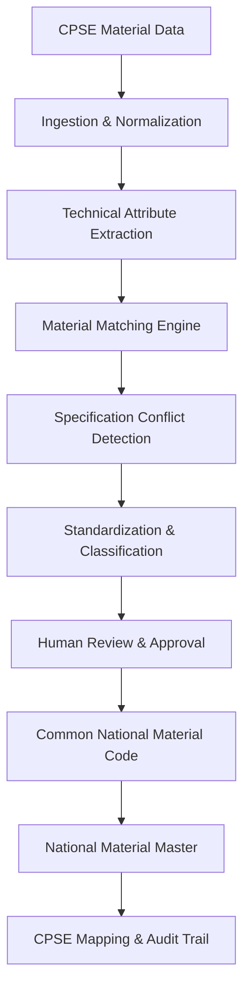

# SamagriSetu

### One Nation. One Common Material Code.

SamagriSetu is an AI-assisted material master harmonization platform designed to address catalog fragmentation and inventory opacity across Indian Central Public Sector Enterprises (CPSEs). Developed around the Smart India Hackathon problem statement **SIH26099** (*Ministry of Petroleum & Natural Gas / Chennai Petroleum Corporation Limited*), the platform provides an automated and auditable mechanism to ingest, normalize, compare, and resolve disparate enterprise material records into a unified national taxonomy.

In industrial operations, different CPSEs—such as upstream exploration, downstream refining, power generation, and heavy manufacturing—frequently procure identical mechanical equipment, valves, pipes, and electrical instruments. However, because each enterprise manages independent Enterprise Resource Planning (ERP) systems, the same physical item is cataloged under divergent CPSE material codes, inconsistent abbreviations, mixed units of measure (metric vs. imperial), and unstructured text strings. This lack of common material identity prevents centralized visibility, duplicates tender efforts, and inflates buffer inventories.

SamagriSetu resolves this by extracting discrete technical attributes (such as equipment type, nominal dimensions, pressure ratings, metallurgy, and design standards) from unstructured descriptions, evaluating cross-enterprise candidates using multi-parameter similarity algorithms, and recommending a standardized **Common National Material Code (CNMC)**. Crucially, the platform operates on a non-destructive governance model: original CPSE material codes are permanently preserved for bi-directional traceability, and deterministic safety hard-locks flag engineering discrepancies for **human validation** before any canonical code is authorized.

---

## Problem

Central Public Sector Enterprises (CPSEs) operate critical national infrastructure across energy, steel, petrochemicals, and heavy industry. Over decades of independent operational history, each enterprise has established proprietary cataloging conventions within separate SAP ECC, SAP S/4HANA, or Oracle ERP installations. 

This decentralized data management creates several systematic challenges:
- **Disparate Material Codes**: An identical industrial component is cataloged under entirely unrelated alpha-numeric identifiers across different enterprises.
- **Unstructured & Inconsistent Descriptions**: Free-text fields feature arbitrary abbreviations, differing word orders, and non-standard syntax (e.g., `GLOBE VALVE 2 IN CL.150 CS SW` vs. `GLB VLV 2" A216 WCB 150# SW`).
- **Unit of Measure (UOM) Inconsistencies**: The same physical dimension is represented interchangeably in imperial and metric units (e.g., `2 INCH`, `2"`, `DN 50`, `50 MM NB`).
- **Redundant Inventory & Procurement Fragmentation**: Independent procurement tenders are published for identical spares without volume aggregation or regional inter-plant stock sharing.
- **Engineering Safety Hazards**: Pure keyword-based catalog merging risks conflating critical safety specifications, such as merging a Class 150 valve with a Class 300 valve or SS304 with SS316 metallurgy.
- **Manual Harmonization Bottlenecks**: Manually cross-referencing hundreds of thousands of line items across enterprise silos is labor-prohibitive without automated attribute extraction and guided decision workflows.

---

## Solution

SamagriSetu introduces a multi-tier harmonization architecture that standardizes public sector material masters while maintaining complete backward compatibility with native ERP systems.

The platform executes a structured, transparent pipeline:
```text
CPSE Material Data (CSV / ERP Export)
        ↓
Data Ingestion & Normalization
        ↓
Technical Attribute Extraction
        ↓
Material Matching & Similarity Scoring
        ↓
Specification Conflict Detection (Safety Hard-Locks)
        ↓
Standardization & Taxonomy Classification
        ↓
Human Review & Authorization (Chief Material Master Reviewer)
        ↓
Common National Material Code (CNMC) Assignment
        ↓
National Material Master Registration
        ↓
CPSE Legacy Code Mapping & Immutable Audit Trail
```

The system is designed as an executive decision-support system: automated algorithms perform the extraction, parsing, and scoring, while designated engineering reviewers retain final sign-off authority.

---

## Core Workflow

The operational flow from raw enterprise data intake to certified canonical master registration is illustrated below:



---

## Key Capabilities

- **Multi-CPSE Catalog Ingestion**: Ingests structured and semi-structured material records from enterprise CSV exports representing multiple industrial entities (ONGC, IOCL, BHEL, SAIL).
- **Automated Text Normalization**: Standardizes abbreviations, removes formatting noise, normalizes dimensional units (e.g., `50MM` → `2" (DN50)`), and canonicalizes equipment descriptions.
- **Deterministic Attribute Extraction**: Extracts discrete engineering parameters, including component type, nominal size, pressure rating, body metallurgy, end connections, and standard specifications (ASME/ASTM/API).
- **Multi-Parameter Material Matching**: Calculates composite similarity scores based on attribute alignment, fuzzy text match, and token-level taxonomy analysis.
- **Safety Hard-Lock Interception**: Automatically blocks automated merging when critical engineering parameters conflict (e.g., Class 150 vs. Class 300, or Carbon Steel vs. Stainless Steel).
- **Canonical CNMC Generation**: Generates structured, unique Common National Material Codes (`CNMC-XXXXXX`) representing canonical equipment identities.
- **Bi-Directional Legacy Traceability**: Maintains persistent 1-to-many cross-reference tables mapping native CPSE enterprise codes to assigned national codes.
- **Human-in-the-Loop Review Console**: Provides an interactive adjudication interface for Chief Reviewers to inspect match evidence, compare attribute matrices, and approve, reject, or defer harmonization.
- **National Master Explorer**: Searchable, filterable repository of approved national materials with full lineage inspection and CPSE coverage indicators.
- **Governance Audit Trail**: Chronological, tamper-evident logging of all system events, upload batches, matching runs, and reviewer decisions.
- **Interactive 3D Topology Visualization**: Real-time WebGL/Three.js visual simulation demonstrating the flow of disparate enterprise streams converging into the harmonized national core.

---

## Architecture

### Current Implementation
The current repository is implemented as a high-performance, single-runtime TypeScript platform running in the browser using React 19 and Vite. The business logic, parsing engines, matching heuristics, and data models are implemented as modular TypeScript services:

```text
┌────────────────────────────────────────────────────────────────────────┐
│                          PRESENTATION LAYER                            │
│  React 19 • Tailwind CSS v4 • Lucide Icons • Three.js 3D Topology       │
├────────────────────────────────────────────────────────────────────────┤
│                           PAGE CONTROLLERS                             │
│  LandingPage • DashboardPage • MaterialReviewPage • CPSEDataPage       │
│  MaterialMatchingPage • DuplicateDetectionPage • AuditTrailPage        │
├────────────────────────────────────────────────────────────────────────┤
│                          SERVICE LAYER (TS)                            │
│  CPSEDataImportService  │ Ingestion, CSV parsing, schema validation    │
│  MaterialMatchingService│ Scoring, attribute extraction, safety locks │
│  NationalMaterialService│ CNMC generation, lineage registry, storage   │
│  AuditTrailService      │ Chronological governance event logging       │
│  DataSourceService      │ Ingestion simulation and channel management  │
├────────────────────────────────────────────────────────────────────────┤
│                         DATA & PERSISTENCE                             │
│  Demonstration Datasets │ ONGC.csv, IOCL.csv, BHEL.csv, SAIL.csv       │
│  State & Persistence   │ In-Memory Reactive Stores & LocalStorage Sync │
└────────────────────────────────────────────────────────────────────────┘
```

### Integration-Ready / Future Architecture
For full production deployment within a national data center or cloud environment, the following extensions represent planned architecture:
- **Enterprise ERP Connectors**: Direct read-only connectors for SAP S/4HANA (OData/BAPI), SAP ECC 6.0 (RFC), and Oracle EBS (MTL_SYSTEM_ITEMS) to pull incremental catalog updates.
- **Central Relational & Vector Storage**: Scaled PostgreSQL backend with `pgvector` for semantic embedding storage and distributed indexing across millions of line items.
- **GeM (Government e-Marketplace) Federation**: Two-way API integration publishing approved CNMCs directly to GeM category managers for tender aggregation.
- **Automated CPSE Synchronization Gateway**: Scheduled synchronization webhooks returning canonical CNMC mappings back into native CPSE ERP material master tables (e.g., populating custom field `MARA-CNMC`).

---

## Technology Stack

| Layer | Technology | Purpose |
|---|---|---|
| **Frontend Framework** | React 19 (`react`, `react-dom` v19.2.8) | Declarative component UI and application state orchestration |
| **Language & Tooling** | TypeScript (`typescript` v6.0.2) | Type-safe domain models, service contracts, and strict interface validation |
| **Build & Bundler** | Vite (`vite` v8.3.0) | High-speed ESM development server and optimized production packaging |
| **CSS & Design System** | Tailwind CSS v4 (`@tailwindcss/vite` v4.3.3) | GovTech institutional styling, high-contrast layouts, and responsive design |
| **Visualization & 3D** | Three.js (`three` v0.186.0) | WebGL-based interactive 3D harmonization topology visualizer |
| **Icons & Micro-UI** | Lucide React (`lucide-react` v1.47.0) | Clean, accessible iconography across navigation and data tables |
| **Code Quality / Linter**| Oxlint (`oxlint` v1.81.0) | High-performance Rust-based static code analysis and lint verification |
| **Data Ingestion** | Custom CSV Processing Script & Service | Structured CSV parsing, header mapping, and attribute tokenization |

*(No external backend frameworks such as Python/FastAPI or external SQL databases are present in this repository; the current release is completely self-contained within the TypeScript application).*

---

## Project Structure

```text
SamagriSetu/
├── data/                                 # Prototype demonstration CSV catalogs
│   ├── BHEL.csv                          # BHEL power & industrial equipment records (100)
│   ├── IOCL.csv                          # IOCL refinery & pipeline records (100)
│   ├── ONGC.csv                          # ONGC upstream exploration records (100)
│   └── SAIL.csv                          # SAIL steel & structural records (100)
├── docs/                                 # Architectural & domain documentation
│   ├── DATA_MODEL.md                     # TypeScript domain schema reference
│   ├── DEMO_FLOW.md                      # Guided walkthrough script for evaluators
│   ├── MATERIAL_HARMONIZATION_WORKFLOW.md# Step-by-step lifecycle documentation
│   └── PROJECT_ARCHITECTURE.md           # System design & component interaction
├── public/                               # Static assets and public-served files
│   ├── data/                             # Publicly accessible CSV catalogs
│   ├── samagrisetu-logo.png              # Official platform emblem
│   └── *.jpg                             # Industrial photography assets
├── scripts/
│   └── parseCSVs.js                      # Utility script for preprocessing CSV records
├── src/
│   ├── components/
│   │   ├── audit/                        # Audit trail timeline and event inspection tables
│   │   ├── cpse-data/                    # Upload wizards, catalog explorer, and detail modals
│   │   ├── dashboard/                    # Executive KPI cards, distribution charts, summaries
│   │   ├── harmonization-flow/           # Three.js 3D WebGL harmonization flow components
│   │   ├── integration/                  # Enterprise ERP connector architecture visualizer
│   │   ├── layout/                       # AppHeader, AppSidebar, AppLayout, and banners
│   │   ├── mapping/                      # CPSE legacy code cross-reference mapping tables
│   │   ├── material-master/              # National master tables, detail modals, 1:N visuals
│   │   ├── material-matching/            # Attribute matrix, match evidence, conflict banners
│   │   ├── review/                       # Review queue, adjudication modals, technical reports
│   │   └── shared/                       # Badges, modals, empty states, 3D topology wrapper
│   ├── data/
│   │   ├── actualCSVDataset.ts           # In-memory compiled demonstration catalog (400 records)
│   │   ├── actualMatchCandidates.ts      # Multi-CPSE match candidates with pre-evaluated scores
│   │   └── syntheticMaterialData.ts      # Legacy benchmark test fixture data
│   ├── pages/                            # 19 dedicated workflow pages & route views
│   │   ├── LandingPage.tsx               # Institutional public landing page
│   │   ├── DashboardPage.tsx             # Central overview & metric telemetry
│   │   ├── MaterialReviewPage.tsx        # Chief Reviewer evaluation & decision queue
│   │   ├── MaterialMatchingPage.tsx      # Matching analysis & attribute comparison console
│   │   ├── CPSEDataImportPage.tsx        # Officer CSV ingestion & parameter parsing portal
│   │   ├── NationalMaterialMasterPage.tsx# Approved canonical CNMC directory
│   │   └── ...                           # Additional operational & audit views
│   ├── services/                         # Core algorithmic and state management services
│   │   ├── CPSEDataImportService.ts      # CSV intake, schema parsing, validation
│   │   ├── MaterialMatchingService.ts    # Similarity engine, attribute extraction, hard-locks
│   │   ├── NationalMaterialService.ts    # CNMC issuance, lineage management, localStorage
│   │   ├── AuditTrailService.ts          # Governance event tracking
│   │   └── DataSourceService.ts          # Enterprise feed simulation
│   ├── types/                            # Strict TypeScript interfaces and domain types
│   ├── App.tsx                           # Master routing, authentication, and persona handler
│   ├── index.css                         # Tailwind CSS v4 styling & typography
│   └── main.tsx                          # React DOM application entry point
├── .gitignore                            # Security & build ignore rules
├── .oxlintrc.json                        # Oxlint configuration
├── index.html                            # HTML5 root template
├── package.json                          # Node.js project manifest & dependency tree
├── tsconfig.json                         # TypeScript compiler configuration
└── vite.config.ts                        # Vite bundler configuration
```

---

## Demonstration Data

This repository includes demonstration datasets located in `data/` and `public/data/`:
- `ONGC.csv`: 100 sample records representing upstream exploration and offshore drilling equipment.
- `IOCL.csv`: 100 sample records representing downstream refining, petrochemicals, and pipelines.
- `BHEL.csv`: 100 sample records representing heavy electrical machinery, power boilers, and turbines.
- `SAIL.csv`: 100 sample records representing integrated steel production, alloys, and structural elements.

> **Important Notice on Data Provenance:**  
> The datasets included in this repository are curated synthetic and sanitized records used strictly for prototype benchmarking, algorithm verification, and demonstration purposes. They illustrate realistic CPSE cataloging patterns (such as SAP short-texts and standard industry abbreviations) and should not be interpreted as classified or proprietary enterprise master data.

---

## Example Harmonization

The following technical scenario illustrates how SamagriSetu ingests three divergent enterprise line items, normalizes their syntax, extracts engineering attributes, and resolves them into a single canonical record:

### Raw Enterprise Input Records
- **CPSE A (ONGC)**: `GLOBE VALVE 2 IN CARBON STEEL CL.150 SW` (Code: `ONGC-000001`)
- **CPSE B (IOCL)**: `GLOBE VALVE 2 IN CL.150 CARBON STEEL SW` (Code: `IOCL-000001`)
- **CPSE C (BHEL)**: `GLB VLV 2" A216 WCB 150# SW` (Code: `BHEL-000001`)
- **CPSE D (SAIL)**: `GLOBE VALVE DN50 CS CL150 SW` (Code: `SAIL-000001`)

### Normalization Process
- **Abbreviation Expansion**: `GLB VLV` → `GLOBE VALVE`, `CS` / `WCB` → `CARBON STEEL (ASTM A216 WCB)`
- **Dimension Unification**: `2 IN`, `2"`, `DN50` → `2 INCH (DN 50)`
- **Rating Standardization**: `150#`, `CL.150`, `CL150` → `ASME CLASS 150`
- **End Connection Standardization**: `SW` → `SOCKET WELD`

### Extracted Technical Attribute Matrix

| Parameter | Standardized Value | Match Concordance |
|---|---|:---:|
| **Component Type** | Globe Valve | 100% |
| **Nominal Size** | 2 Inch (DN 50) | 100% |
| **Pressure Class** | ASME Class 150 | 100% |
| **Body Metallurgy** | Carbon Steel (ASTM A216 WCB) | 100% |
| **End Connection** | Socket Weld (SW) | 100% |
| **Design Standard** | ASME B16.34 | 100% |

### Outcome
1. Composite Similarity Score calculated at **98.5%**.
2. No engineering hard-lock violations detected.
3. Recommended Canonical Identifier: **`CNMC-000001`**.
4. Standardized Description: `GLOBE VALVE, 2 INCH (DN 50), CARBON STEEL (ASTM A216 WCB), ASME CLASS 150, SOCKET WELD (SW), ASME B16.34`.
5. Original CPSE codes (`ONGC-000001`, `IOCL-000001`, `BHEL-000001`, `SAIL-000001`) remain permanently mapped to `CNMC-000001`.

---

## Specification Conflict Handling

In industrial and petrochemical installations, physical compatibility is strictly constrained by thermodynamics, pressure tolerances, and metallurgy. Merging catalogs based purely on lexical proximity without specification verification introduces catastrophic operational risks.

SamagriSetu implements deterministic **Safety Hard-Locks** that intercept conflicts regardless of text similarity:

| Conflict Type | Example Divergence | Text Similarity | Hard-Lock Action |
|---|---|:---:|---|
| **Pressure Rating Mismatch** | ASME Class 150 vs. ASME Class 300 | 92% | **STRICT BLOCK** (`REQUIRES REVIEW` / `KEEP SEPARATE`) |
| **Metallurgical Incompatibility** | Stainless Steel 304 vs. Stainless Steel 316 | 94% | **STRICT BLOCK** (Corrosion boundary variance) |
| **Dimensional Schedule Mismatch** | Schedule 40 vs. Schedule 80 | 89% | **STRICT BLOCK** (Wall thickness & ID divergence) |
| **Gasket Sealing Material** | EPDM Rubber vs. Flexible Graphite | 86% | **STRICT BLOCK** (Temperature tolerance failure) |

When an engineering hard-lock is triggered:
1. Automated merging is unconditionally disabled.
2. The match candidate is flagged with an amber/red discrepancy badge.
3. The conflict is logged into the audit trail with the specific technical attribute disparity identified.
4. The record is routed directly to the Chief Reviewer's adjudication queue.

---

## Human-in-the-Loop Review

SamagriSetu operates on the principle that artificial intelligence should augment, rather than replace, certified engineering judgment.

The **Human-in-the-Loop** governance workflow provides:
- **Decision Console**: Chief Material Master Reviewers are presented with side-by-side attribute comparisons, highlighted parameter variances, and match evidence summaries.
- **Explicit Action Outcomes**:
  - **Approve**: Confirms equivalence and assigns or maps to a Common National Material Code.
  - **Reject**: Confirms that items are technically distinct; enforces separate identity creation.
  - **Defer / Request Information**: Routes catalog items back to the originating CPSE nodal officer for field verification.
- **Traceable Decision Record**: The identity, timestamp, and rationale of the reviewer are cryptographically recorded in the chronological audit log.

---

## Traceability

A foundational requirement of national harmonization is non-destructive federation. SamagriSetu preserves existing enterprise ERP investments by maintaining persistent bi-directional linkages:

```text
┌────────────────────────────────────────────────────────┐
│              COMMON NATIONAL MATERIAL CODE             │
│                      CNMC-000001                       │
│    GLOBE VALVE, 2 IN, CS, CL 150, SW, ASME B16.34      │
└───────────┬──────────────┬──────────────┬──────────────┘
            │              │              │
            ▼              ▼              ▼
     ┌─────────────┐┌─────────────┐┌─────────────┐
     │  ONGC CODE  ││  IOCL CODE  ││  BHEL CODE  │
     │ ONGC-000001 ││ IOCL-000001 ││ BHEL-000001 │
     └─────────────┘└─────────────┘└─────────────┘
```

- Local plant operations continue utilizing native ERP part numbers without disruption.
- Corporate, inter-ministerial, and GeM procurement queries resolve through the CNMC umbrella to view aggregated availability across all federated plants.
- Lineage records record the exact timestamp, source CPSE catalog, and original raw string for every mapped item.

---

## Current Implementation Status

### Implemented
- Complete interactive web platform with 19 functional pages and executive landing portal.
- Ingestion engine parsing multi-CPSE CSV catalog exports.
- Automated attribute extraction and normalization algorithms.
- Multi-parameter similarity scoring engine with deterministic safety hard-locks.
- Chief Reviewer adjudication queue with real-time approval/rejection state transitions.
- Canonical Common National Material Code (CNMC) generation and LocalStorage persistence.
- Bi-directional 1-to-many legacy mapping explorer.
- Chronological governance audit trail logging system events.
- Interactive Three.js / WebGL 3D harmonization topology simulation.
- 1-click persona switcher (CPSE Enterprise Nodal Officer vs. Chief Material Master Reviewer).

### Prototype / Demonstration
- Curated 400-record benchmark catalog representing ONGC, IOCL, BHEL, and SAIL.
- In-browser simulated data stream channels for testing live catalog feeds.
- Pre-computed engineering match candidates illustrating key evaluation scenarios.

### Planned / Integration-Ready
- Native SAP S/4HANA OData and SAP ECC 6.0 RFC enterprise connectors.
- Multi-node PostgreSQL database deployment with pgvector semantic similarity search.
- Official GeM API gateway for automated tender item standardization.
- Real-time enterprise ERP write-back interfaces.

---

## Getting Started

### Prerequisites
- **Node.js**: Version 18.x or higher (tested on Node.js v24.x)
- **Package Manager**: `npm` (included with Node.js)

### Installation
1. Clone the repository:
   ```bash
   git clone https://github.com/shubham25-droid/SamagriSetu.git
   cd SamagriSetu
   ```

2. Install project dependencies:
   ```bash
   npm install
   ```

### Running the Application
Start the local development server:
```bash
npm run dev
```
Open your browser and navigate to `http://localhost:5173/` to access the platform.

### Building for Production
To verify TypeScript types and generate the optimized production distribution:
```bash
npm run build
```
The compiled output is emitted to the `dist/` directory.

### Code Quality & Linting
Run static code analysis using Oxlint:
```bash
npm run lint
```

---

## Environment Variables

This prototype platform runs entirely client-side using self-contained TypeScript services and local storage.

- **No external `.env` file is required** to run the demonstration.
- **No private API keys, passwords, or cloud database credentials** are necessary.
- Security rules in `.gitignore` ensure that any local `.env` or certificate files created during development are strictly excluded from version control.

---

## Usage

A standard evaluation walkthrough involves the following steps:

1. **Access the Portal**: Open `http://localhost:5173/` to view the SamagriSetu Landing Page and 3D Harmonization Topology.
2. **Select Persona**:
   - Click **`1. CPSE Officer`** to access the enterprise ingestion workstation.
   - Click **`2. Central Reviewer`** to access the Chief Material Master Reviewer console.
3. **Explore CPSE Catalogs**: Navigate to **CPSE Catalogs** (`#participating-cpses`) or click **Inspect CPSE Master** to review 400 benchmark records across ONGC, IOCL, BHEL, and SAIL.
4. **Ingest New Catalog Data**: Go to **Catalog Ingestion**, upload a plant CSV file (or use sample records), and review automated parameter parsing.
5. **Run Specification Matching**: Navigate to **Matching Console** to inspect match candidates, examine the attribute matrix, and review safety hard-lock flags.
6. **Execute Human Review**: Navigate to **Review Workstation**, select a pending candidate, inspect evidence, and click **Approve Harmonization** to issue a canonical CNMC.
7. **Inspect National Master**: Open **National Master** to verify the newly registered Common National Material Code and confirm bi-directional legacy mapping to source CPSE codes.
8. **Verify Audit Trail**: Open **Audit Trail** to view the chronological, immutable record of ingestion, matching, and approval events.

---

## Screenshots

Interface walkthroughs and interactive components can be inspected directly via the running web portal:
- **Platform Emblem & Branding**: `public/samagrisetu-logo.png`
- **Interactive 3D Harmonization Flow**: Available on the landing page (`#topology-3d`)
- **Real-Time Dashboards & Consoles**: Available via local execution (`npm run dev`)

---

## Research / Problem Context

SamagriSetu was conceived and engineered specifically to address Problem Statement **SIH26099** in the Smart India Hackathon:
> *"AI-Driven Standardization and Harmonization of Material Codes Across CPSEs"*  
> **Nodal Ministry**: Ministry of Petroleum & Natural Gas  
> **Nodal Organization**: Chennai Petroleum Corporation Limited (CPCL)  
> **Theme**: Smart Automation | **Category**: Software

The project demonstrates how domain-calibrated deterministic algorithms, combined with structured technical attribute decomposition and human-in-the-loop oversight, solve the decades-old challenge of enterprise master data fragmentation across India's public sector ecosystem.

---

## Team

**SamagriSetu Team**  
*Team BodhZ — Smart India Hackathon 2026*  
Problem Statement: SIH26099

---

## Copyright & Proprietary Notice

© 2026 SamagriSetu Team. All Rights Reserved.

SamagriSetu, its source code, architecture, interface designs, documentation, and original project materials are proprietary to the SamagriSetu Team.

This repository is intended for authorized development, evaluation, and demonstration purposes only.

No permission is granted to copy, reproduce, modify, distribute, publish, repurpose, or create derivative works from this project or its source code without prior written permission from the copyright holders.

SamagriSetu is a project developed for Smart India Hackathon 2026.
